#### Identification of the problem you are trying to solve by building this particular marketplace app.

It's not easy to find a trustworthy baby sitter and it's not possible to know more information such as the quality of the service, feedback of the baby sitter etc. For babysitters as well it's very hard 
to find parents who are looking for the babysitting service. This Babysitter Booking app connects parents and babysitters. Any one interested can register as babysitter and parents can connect with this babysitter and make booking. 

This baby sitter app addresses following problems

 - Parents get only limited option to choose a babysitter
 - Can not see the review and ratings of babysitters.
 - It's not easy for new babysitters to enter in to the market.
 -  No service allows babysitters to connect with parents and vice versa.


#### Why is it a problem that needs solving?

Parents have hard time to find babysitter and never be confident about the babysitters and for the new babysitters it's very hard to enter the market and find customers. 

This application helps the parents to find a trustworthy baby sitter based on reviews and ratings and 
other informations and helps the babysitter to register easily and find more clients quickly.

#### links 
  * Deployed website: https://radiant-temple-23791.herokuapp.com/home
  * Github: https://github.com/kshamseera/Baby_sitter-app
  
#### Description of your marketplace app 

##### Purpose
The purpose of my marketplace app is to design a functional two-way marketplace that is easy to use for anyone to register as a babysitter and allows the user to book for a particular babysitter. To allow the babysitters an effective way to show case thier skills and for potentional users as a parent to be able browse by city and can book from the web-app.

##### Functionality and features

##### Main features:

* Babysitter app will use Devise. Devise provides a full authentication package with views, controllers and routes to allow users to sign up, edit user profiles, reset passwords, etc. Devise can be used without the database authentication module with provides signup via email password.
* Sign up for a new account as a user or a babysitter via a sign up form that takes information such as user name, email and password.
* Users can search for the babysitters based on a city.
* Can view the websites available baby sitters listings .
* Authenticate the users for making the booking with the baby sitters.
* Once the booking has been done, they will get a confirmation message and can also view their current and previous booking details from their dashboard.
* Babysitters also can see their dashboard when they logged_in. And from the dashboard they see their complete profile and current bookings. They can also make the status of booking to 'Accept' from the dashboard.
* Once the baby sitter set the status to 'Accept', it will notify to the users dashboard as well.
* From the dashboard both user and baby sitters can edit their details. Users also can delete the booking.
* Babysitters cannot make booking with other babysitters. But they can search and view all the available baby sitters details.

##### Other Features:
* User Authorisation
* Input validation.
* AWS Image hosting.

##### Sitemap

##### Screenshots
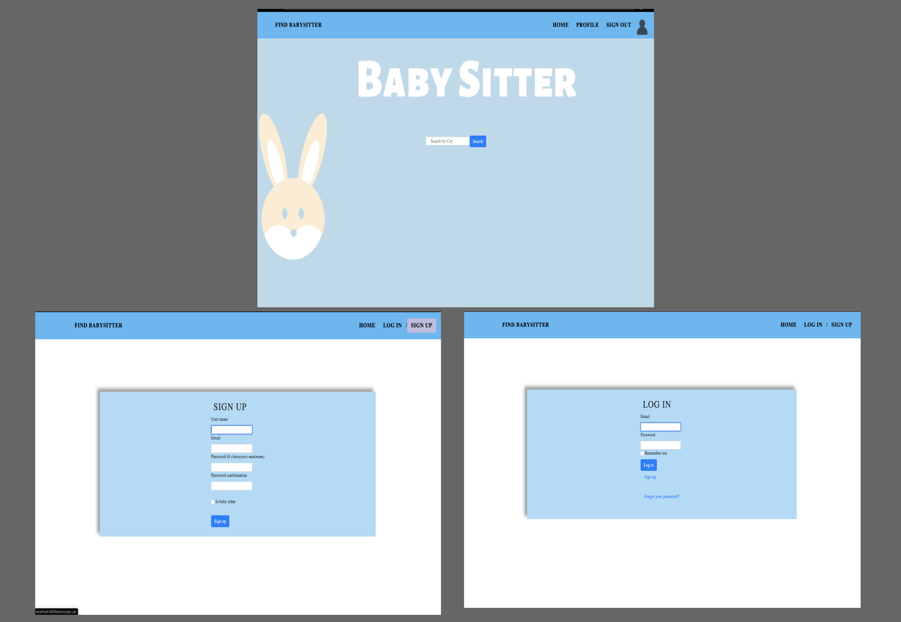
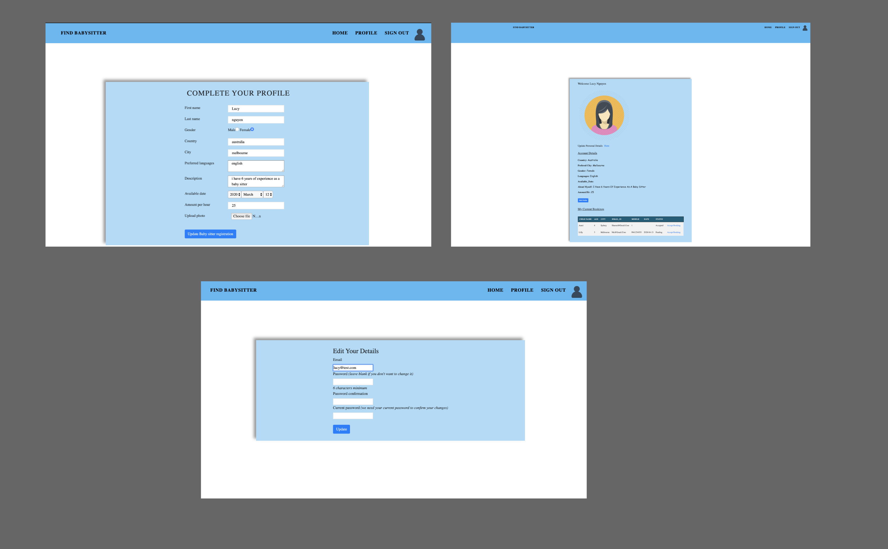
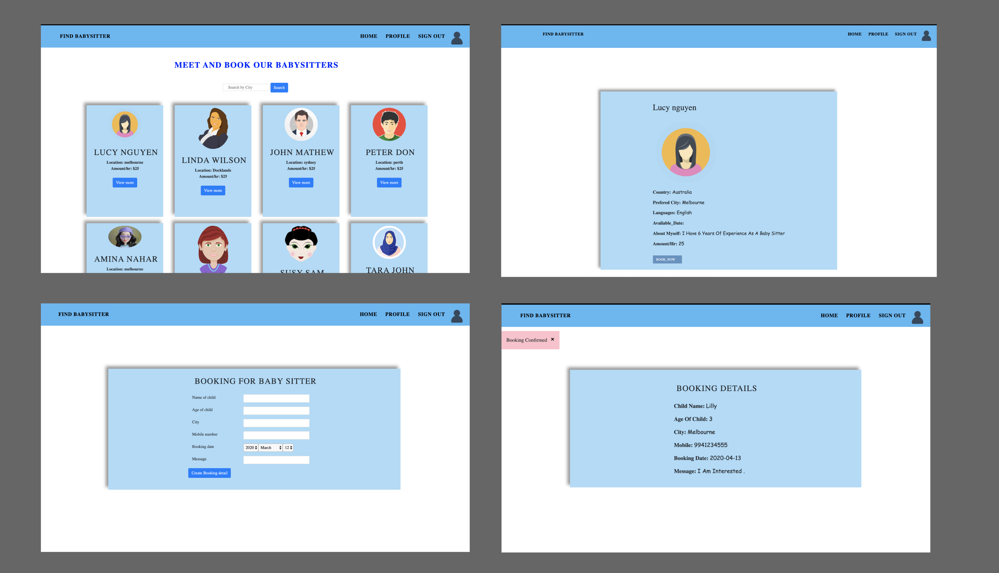
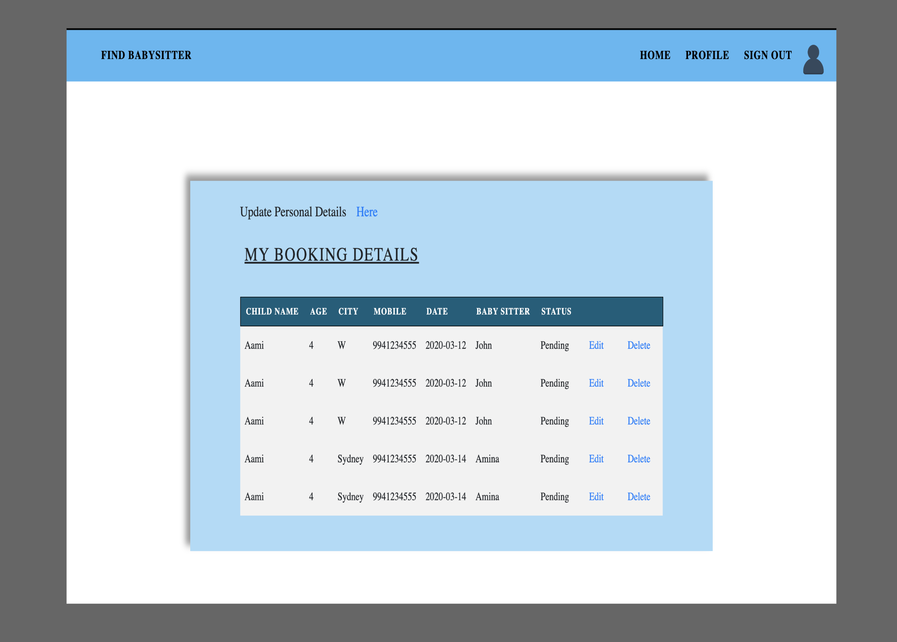
##### Target Audience

Parent - Parent who want a babysitter for their active children, can search for babysitters and make booking with a babysitter.
Babysitter - Can register as babysitter and can connect with parents and get bookings.

##### Tech stack 

* Ruby 2.5.1: Ruby is the main programming language used in BabySitter App 
*  Ruby on Rails: Rails is an open source development framework for web applications written in Ruby. As a model-view-controller framework, it provides the database structure
* PostgreSQL: This database is used for storing the data of the application.   
* Bootstrap: 
* HTML: Hypertext Markup Language was used for the structure of Babysitter app pages with embedded ruby (erb)—HTML with Ruby code inside it. This allowed the development to include Ruby functionality in a format that the code could output a pure HTML file.
* CSS: I used SCSS, a superset of CSS, so that we were able to extend the functionality of CSS, including by storing styles as variables and nesting.

* Heroku for deployment
* AWS S3 for image uploading
* Github
#### User stories 

##### User as a Babysitter:

* Website allows user to signup as a babysitter.
* Once the babysitter sign up, they can complete their profile via a form. That takes the information such as first name, last name, country,city, available date,amount/hr and allows to upload their own image.
* They have their own profile page, where they can see their profile information and current booking details. 
* They can edit both personal details(email and password) and profile details.
* It also possible for the babysitter to set the status of bookings.(pending/accepted).
* Cannot make a booking.

##### User as a Parent:

* Website allows the user to sign up.
* Can view all the available babysitters
* User can search for a babysitter based on a city.
* Once the user logged in, they can see full details of a particular babysitter.
* Allows the user to make a booking with a babysitter via a form, that takes information about the child and the date to which  they want to make a booking.
* Once the user made booking,website shows booking confirmation notice and also displays the booking details.
* User can view their booking details in their profile page.
* From the profile page, user can Edit and Delete the booking.
* It is also possible to update their personal information such as email and password from the profile page.
* It is possible to view their current status of the booking they made. 
  


#### Wireframes for your app

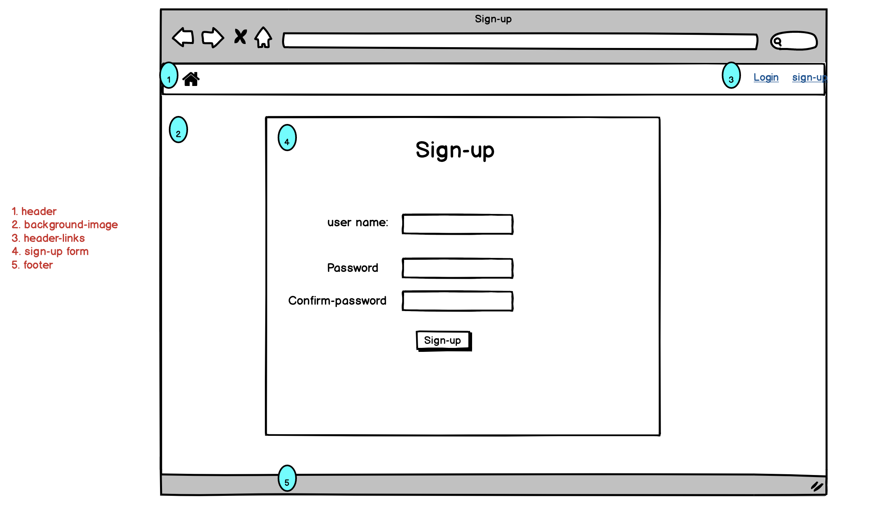
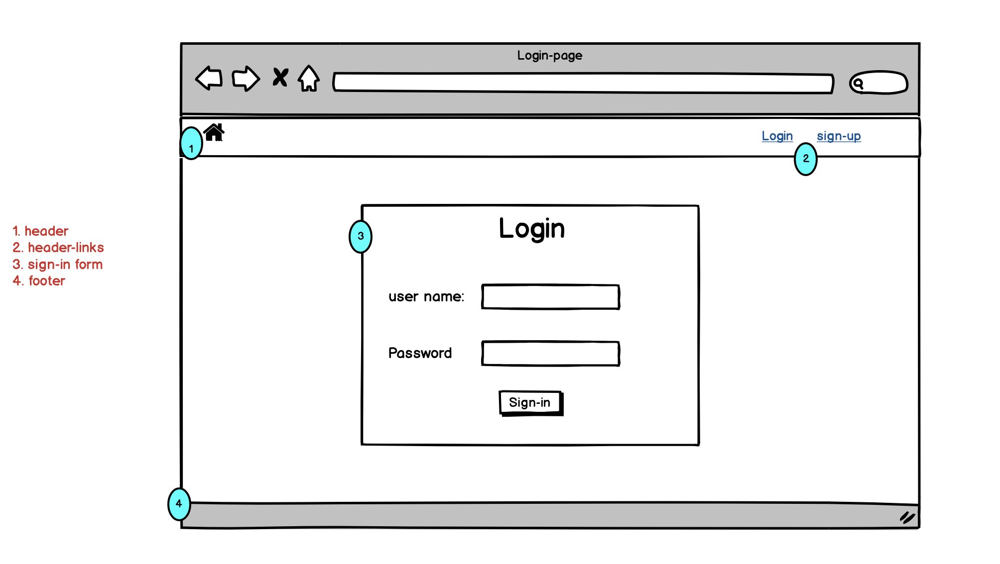
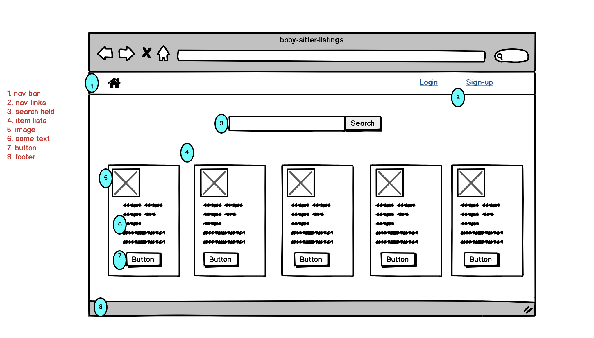


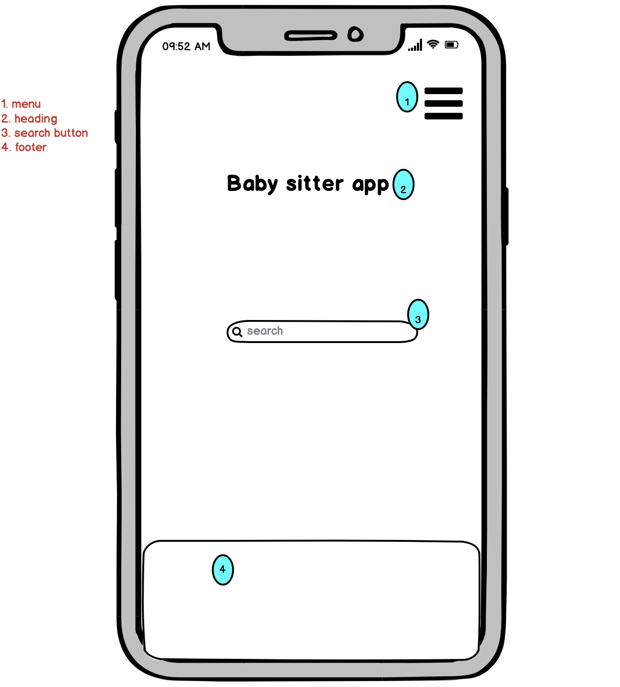
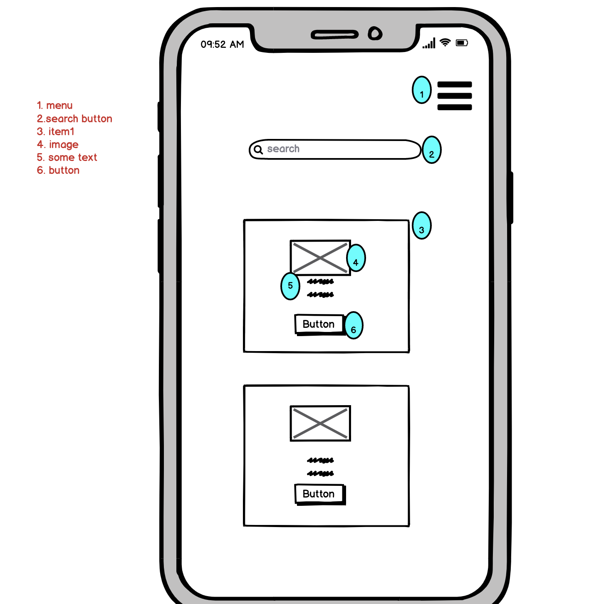

#### An ERD for your app


#### Explain the different high-level components (abstractions) in your app

* Active-Record
  
One of the high-level components in my application is Active-Record. Active-Record is a design pattern that uses the MVC (Model, View, Controller) to map the columns inside your table. Doing this provides us with ORM (Object Relational Mapping). Doing this allows us to access our SQL database (In our case PostgreSQL) without having to write SQL statements. Active-Record also allows us the ability to represent our models and their data, associations between our models, represent inheritance through related models and validate models before they get persisted to the database. These columns are accessed by methods are inferred inside the database schema.

* Routes

One significant level of abstraction in Rails is the routes. The routes allow the app to match requests (e.g. GET, POST) to an action in the controller. Ultimately, this will direct the user to a URL, and because of this abstraction, we are not required to hard code the URLs or routes as strings.

* View is the information that the user can see and interact with.
* Controller is what handles the user's inputs
  
Entering the URL in a browser will send a request to a web server. Using resources, it's able to create RESTful routes for our components and generate paths in the app.

Once the server receives a request, it will map the URL path to the controller it needs (e.g. to create or edit a login from a user) and the view part of the app will render a page where the user sees a certain page, in this case a login page. Once a user logs in or signs up for example, the model comes into play, getting  all users from the database and rendering the home page to the user with their user account details rendering on the page.

* Partial- Partials allow to extract pieces of code from your templates to separate files and also reuse them throughout your templates. In my app, i have used two partials and render into the other view files.

#### Detail any third party services that your app will use

* **Heroku**: Heroku is a cloud application platform – a new way of building and deploying web apps. Best thing about Heroku is that we don’t have to pay for hosting basic web apps as Heroku has categorized them as free. Heroku applications work better with the PostgreSQL database system, so that i used postgresql in my rails app.Heroku's Git server handles application repository pushes from permitted users. 
  
All Heroku services are hosted on Amazon's EC2 cloud-computing platform

* **AWS S3**: AWS cloud S3 service is used for uploading and storing the images. It can speed up the uploading process. App allows the babysitter to upload image via form.

* PostgreSQL: This database is used for storing the data of the application. 
  

#### Describe your projects models in terms of the relationships (active record associations) they have with each other

Application has three models such as User, BabySitterRegistration and BookingDetail. 

User is a devise model which captures the signup information. BabySitterRegistration capture 
the information of the babysitter. BookingDetail stores the booking details made by the user.

User has one to one relationship with BabySitterRegistration. BookingDetail has many to one 
relationship with User and BabySitterRegistration.

##### User
  
```
has_one :baby_sitter_registration
has_many :booking_details
```
* The User model also has_one baby_sitter_registration
* The User model has_many relationship with the booking details.Beacuse each user can be many booking details.

##### BabySitterRegistration
```
has_one_attached :upload_image
belongs_to :user
has_many :booking_detail
```
* BabySitterRegistration model has_one_attached. This is allows the babysitter to upload one image of their own via AWS.
* BabySitterRegistration model belongs to the user table because it gives extra information to that table.
* BabySitterRegistration model has_many booking_details. Because user can make many bookings and each user has_one baby_sitter.

##### BookingDetail
```
belongs_to :user
belongs_to :baby_sitter_registration
```
* BabySitterRegistration model belongs to the user table because it gives extra information to that table.
* BookingDetail also belongs_to baby_sitter_registration because the baby_sitter_registration model gives information to the BookingDetail model. 
  
#### Discuss the database relations to be implemented in your application
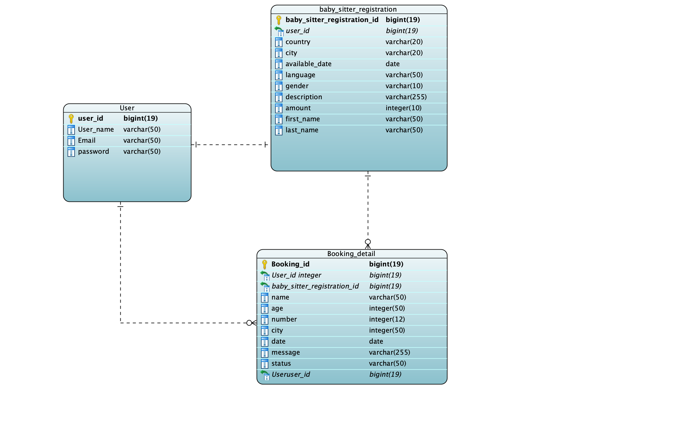


#### Provide your database schema design


* Active Storage Attachment/Blob Models:

These tables are implemented for us by AWS when we install their functionality, and we don't have any choice over the attributes and datatypes.


* User model:
  
  These models are part of the devise. I customized this model by running migration to add username and is_baby_sitter field. In this table user_id is the primary key.

  

* BabySitterRegistration model:
  
  These models are designed to store all the babysitter details. In this table 'baby_sitter_registration_id'is the primary key. This table is related to both User and BookingDetail model. So it has two foreign keys, 'user_id' and 'booking_detail_id'. I used 'text' data type instead of 'string' ,for the description because sometimes it needs more than 255 characters. For the date field i used 'date' datatype.

* BookingDetail model:
  
  These models are designed to store all the booking details of the user. 'Booking_detail_id' is the primary key. This model has connection with both User and BabySitterRegistration model. So it has two foreign keys,'user_id' and baby_sitter_registration_id'. Here i used 'text' data type for the message field. For the date field i used 'date' data type. For all other field i used 'string' as data type.

  

  All models are created by running 'rails g model model name' command. Some times i customize the models by running the migrations to add or remove columns from the table.

#### Describe the way tasks are allocated and tracked in your project
During this project I used Trello having used it in previous assignments I found it a really helpful way to keep tracking of what I need to do, what I'm currently working on and what I've completed already. You can see my attached screen grabs of my progress below.
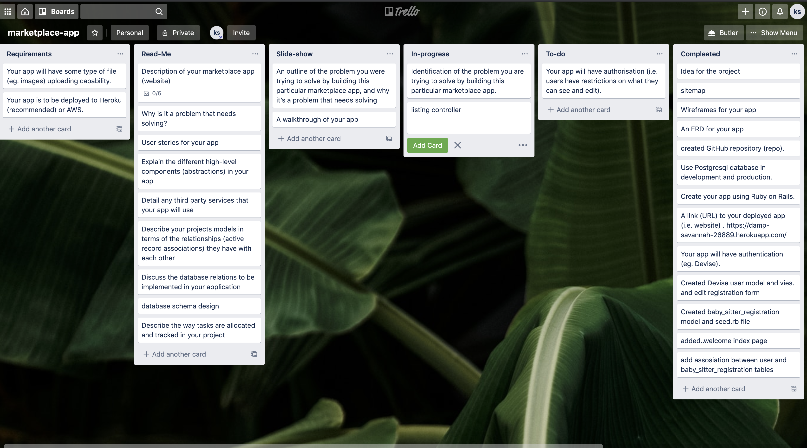
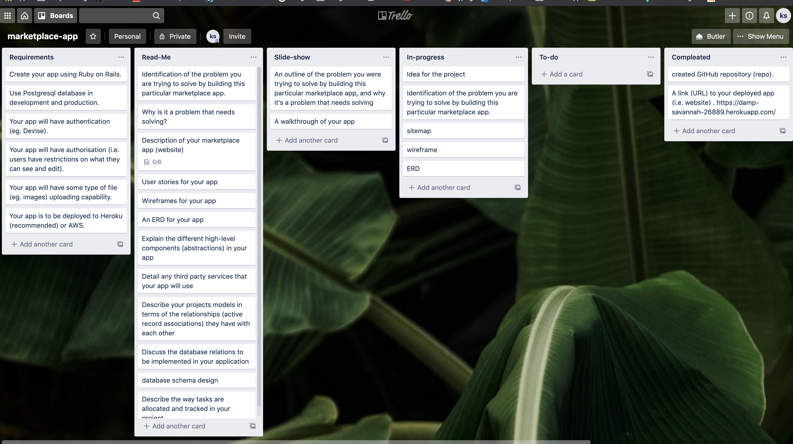
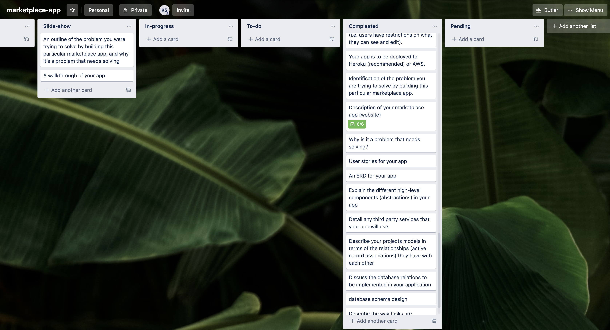


This README would normally document whatever steps are necessary to get the
application up and running.

Things you may want to cover:

* Ruby version

* System dependencies

* Configuration

* Database creation

* Database initialization

* How to run the test suite

* Services (job queues, cache servers, search engines, etc.)

* Deployment instructions

* ...
